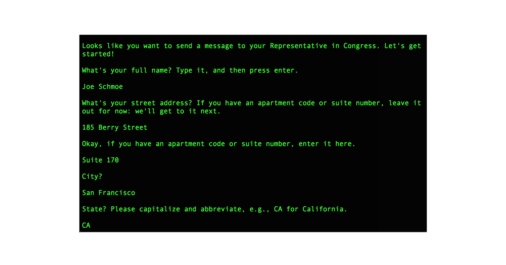

Mail-A-Rep
===========

This application enables you to send a physical letter to your United States Congress Representative without ever touching a pen or an envelope. You input your name, postal address, and the body of the letter you want to send. The application sends this information to the Google Civic Information API and uses it to find the name and address of your representative. Then, it sends the address and letter body you provided and your representative's information to the Lob API, which creates and sends a letter on your behalf.

Neat, right?

#### Built with...

- Python
- Lob API
- Google Civic Information API
- Requests library



#### Installation

This program is written in [Python](https://www.python.org/downloads/) 2.7, so you'll need to download and install this version of Python in order to run it, if it's not installed on your machine already.

Make sure to download the installer for your specific operating system (e.g., Mac OS, Windows, or Linux).

You'll also need a [Lob](https://lob.com) account in order to get the Lob credential you'll need to provide. Visit https://dashboard.lob.com/#/register and create an account to obtain your Lob API key. Likewise, you'll need to obtain an API key for the Google Civic Information API, as described [here](https://developers.google.com/civic-information/docs/using_api). Once you've gotten your Google API key, be sure to also do a search from the Google developer console for the Google Civic Information API and, once you've found it, enable it.

Next, save your crendentials in a secrets.sh in the directory where you saved the application, in the format shown below:
```
export LOB_API_KEY="XXXXXXXXXXXXXXXXXXXXX"
export GOOGLE_API_KEY=="XXXXXXXXXXXXXXXXXXXXXXXXXXXXXXXXXX"
```

Then, create and activate a virtual environment. (Head [here](https://virtualenv.pypa.io/en/stable/installation/) first if you don't have virtualenv installed.) When you're ready, use your command line to navigate to the folder where you saved the application and then run the following commands:
```
virtualenv env
```
```
source env/bin/activate
```
Then you can install the dependencies for this application using pip:

```
pip install -r requirements.txt
```
Finally, source your secrets.sh file and run the letter_generator file.
```
source secrets.sh
```
```
python letter_generator.py
```